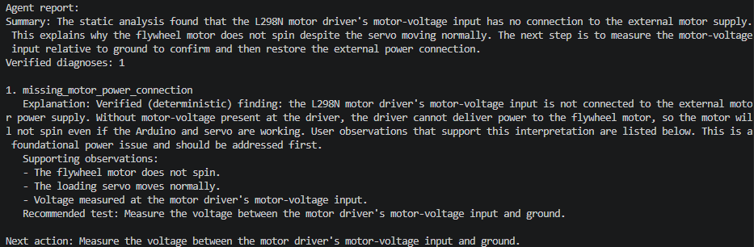
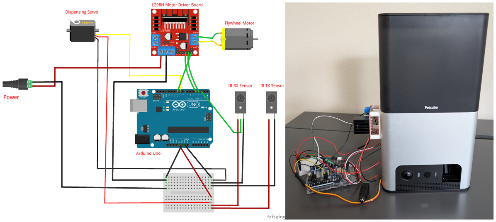
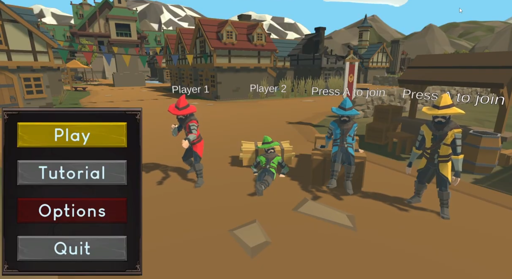
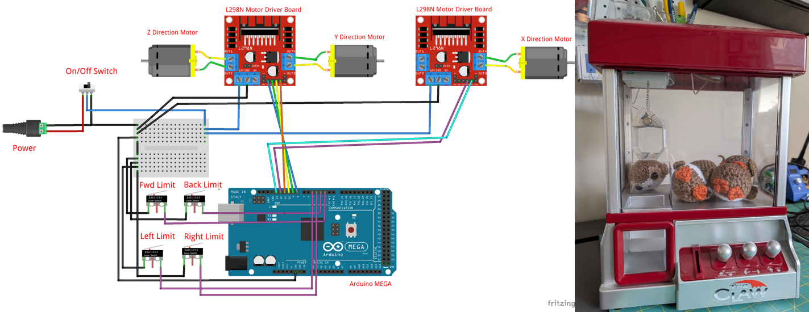

# Hi, I'm Joshua Shigemitsu 👋

I'm a software engineer with a background in aerospace, mechanical engineering, simulation, and developer tooling. I enjoy building reliable systems that connect software with real-world engineering problems.

I recently completed my **M.S. in Computer Science from Georgia Tech**, specializing in artificial intelligence. Before that, I spent more than ten years at Boeing working across software development, propulsion engineering, manufacturing technology, and simulation.

## What I Work On

* Python applications and developer tools
* AI-assisted and agentic workflows
* CI/CD pipelines and automated testing
* Engineering analysis and simulation
* Hardware/software integration
* Full-stack and API development

## Featured Projects

### [Agentic Hardware Troubleshooting Agent](https://github.com/jshigemitsu/Hardware-Debug-Agent)

An agentic diagnostic workflow that analyzes hardware configurations, firmware, and known symptoms.

* Uses deterministic engineering checks before invoking an LLM
* Validates structured project data with Pydantic
* Detects wiring, power, PWM, interrupt, pin-mode, and firmware inconsistencies
* Produces structured findings and recommended troubleshooting steps
* Includes a CLI, unit tests, and reusable diagnostic rules

**Technologies:** Python, Pydantic, pytest, OpenAI API

### [Live Stream Interactive Project: Pet Treat Dispenser](https://github.com/jshigemitsu/Interactive-Arduino-Project)

A physical treat dispenser that allows livestream viewers to launch treats using chat commands.

* Connects livestream chat commands to a Python control application
* Communicates with an Arduino over serial
* Controls a servo loader, flywheel motor, motor driver, and break-beam sensor
* Combines mechanical design, electronics, firmware, and software automation

**Technologies:** Python, Arduino, C++, Serial Communication, Electronics

### [Gift Redemption App](https://github.com/jshigemitsu/Gift-Redemption-App)

A full-stack web application that manages gift selection, redemption, and fulfillment workflows.

* Built an interactive React interface for browsing and filtering available inventory
* Enabled users to add multiple items to a gift bag before submitting a redemption
* Collected mailing information through a structured submission form
* Designed relational PostgreSQL records for gifts, inventory, and redemptions
* Created a fulfillment workflow for tracking submitted redemption requests

**Technologies:** React, JavaScript, Supabase, PostgreSQL, HTML, CSS

### [Magic Mayhem](https://github.com/jshigemitsu/MagicMayhem)

A four-player cooperative game developed as part of Georgia Tech's Game Design course.

* Implemented player abilities and gameplay systems
* Developed enemy behavior and spawning logic
* Built NPC, shop, and level-transition functionality
* Collaborated with a distributed development team

**Technologies:** Unity, C#

### [Live Stream Interactive Project: Crane Game](https://github.com/jshigemitsu/TwitchPlays-Crane-Game)

A crane game that allows livestream viewers to play through chat messages.

* Connects livestream chat commands to a Python control application
* Communicates with an Arduino over serial
* Controls a motor drivers, 3 DC motors and 4 limit switches to control claw boundaries
* Combines mechanical design, electronics, firmware, and software automation

**Technologies:** Python, Arduino, C++, Serial Communication, Electronics

## Technical Skills

**Languages**

`Python` `Java` `JavaScript` `C#` `MATLAB` `HTML` `CSS` `C++`

**Software Engineering**

`Object-Oriented Design` `REST APIs` `Unit Testing` `Git` `CI/CD` `Docker` `Agile Development`

**AI and Data**

`LLM APIs` `Agentic Workflows` `PyTorch` `Pydantic` `NumPy` `Structured Data Validation`

**Engineering and Hardware**

`Arduino` `MATLAB` `Simulink` `Simscape` `Serial Communication` `Engineering Simulation`

## Professional Background

At Boeing, I developed and supported engineering software used for aircraft analysis and simulation. My work included:

* Owning the lifecycle of engineering analysis tools
* Building GitLab CI/CD pipelines and Docker-based workflows
* Developing MATLAB and Simscape applications
* Automating technical reports and compliance analyses
* Debugging and maintaining flight-test monitoring software
* Mentoring engineers and improving code-review practices
* Collaborating with mechanics, suppliers, analysts, and engineering teams

My engineering background helps me approach software through understanding the physical system and designing software that makes it easier to analyze, test, and operate.

## Currently Learning

* Production-ready AI agent architectures
* LLM evaluation and observability
* Backend and cloud-native system design
* Reliable tool use and structured AI outputs
* Scalable software architecture

## Connect With Me

[LinkedIn](https://www.linkedin.com/in/joshua-shigemitsu/)
